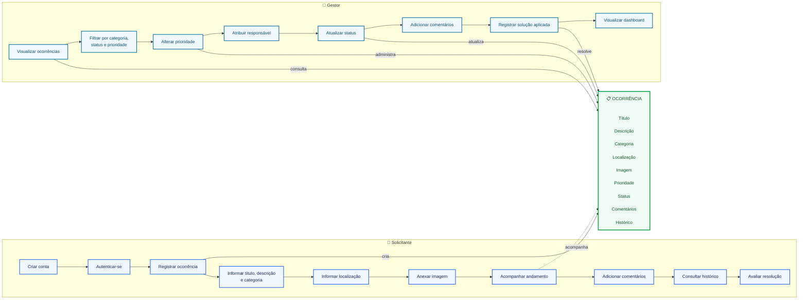
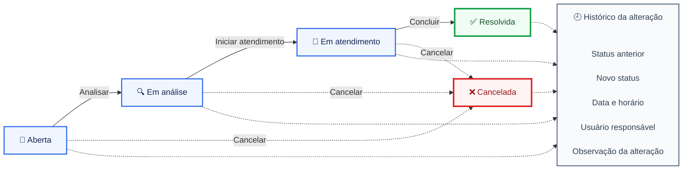
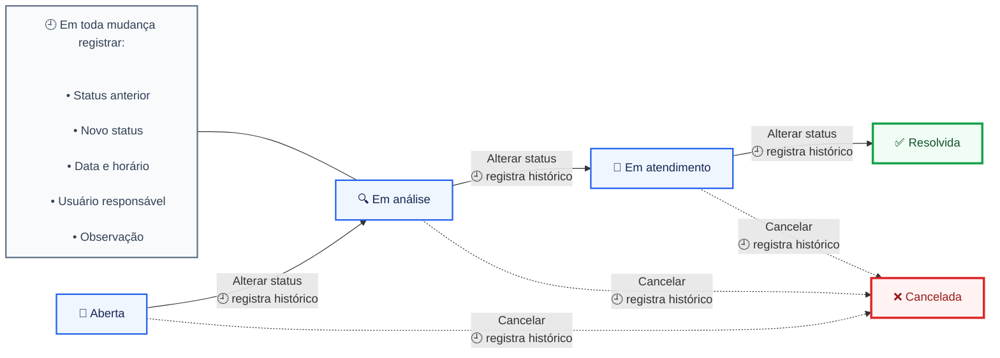

[VOLTAR](./README.md)

Desafio Full Stack Development
Resolve Aí — Plataforma de Gestão de Ocorrências

1. Contexto
   Condomínios, empresas, bairros e organizações enfrentam dificuldades para registrar,
   acompanhar e resolver problemas do dia a dia.
   Normalmente, as solicitações chegam por mensagens, e-mails ou conversas informais,
   dificultando a priorização e o acompanhamento.
   O desafio dos grupos será desenvolver uma plataforma digital chamada Resolve Aí, permitindo
   que usuários registrem ocorrências e acompanhem todo o processo até sua resolução.
   Exemplos de ocorrências:
   ● Problemas de iluminação;
   ● Equipamentos quebrados;
   ● Falta de acessibilidade;
   ● Problemas de limpeza;
   ● Vazamentos;
   ● Problemas de segurança;
   ● Solicitações de manutenção;
   ● Outras situações definidas pelo grupo.

Objetivo
Desenvolver uma aplicação Full Stack completa (MVP), desde a descoberta do domínio até a
publicação em ambiente Cloud.
A solução deverá contemplar:
● Arquitetura de software;
● Backend;
● APIs;
● Banco de dados;
● Frontend;
● Testes;
● Docker;
● Deploy em Cloud;
● Documentação;

Fluxograma
Perfis e responsabilidades

Ciclo de vida da ocorrência

Fluxo geral

Perfis de usuário
imagem perfis-de-usuario.png

Solicitante
Responsável por registrar e acompanhar uma ocorrência.
Deverá ser capaz de:
● Criar uma conta;
● Autenticar-se;
● Registrar uma ocorrência;
● Informar título, descrição e categoria;
● Informar localização;
● Anexar uma imagem;
● Acompanhar o andamento;
● Adicionar comentários;
● Consultar o histórico;
● Avaliar a resolução.
Gestor
Responsável por analisar e administrar as ocorrências.
Deverá ser capaz de:
● Visualizar todas as ocorrências;
● Filtrar por categoria, status e prioridade;
● Alterar prioridade;
● Atribuir um responsável;
● Atualizar o status;
● Adicionar comentários;
● Registrar a solução aplicada;
● Visualizar indicadores em um dashboard.
Fluxo principal
Cada ocorrência deverá possuir, no mínimo, os seguintes estados:

1. Aberta;
2. Em análise;
3. Em atendimento;
4. Resolvida;
5. Cancelada.
   Toda mudança de status deverá ser armazenada em um histórico contendo:
   ● Status anterior;
   ● Novo status;
   ● Data e horário;
   ● Usuário responsável;
   ● Observação da alteração.
